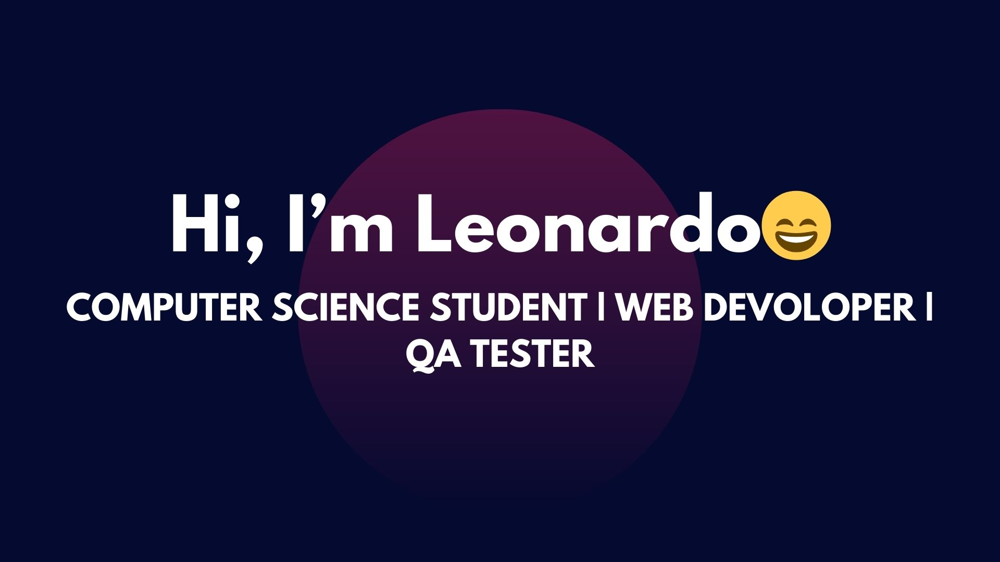

#  🌟 Welcome to my GitHub Profile! 🌟

Hello there! 👋 I'm 25 years old and currently studying Computer Science at the University of Buenos Aires (UBA). I’m also a Fullstack Developer with experience using frameworks such as Bootstrap, Django, and Flask. Recently, I completed a QA Manual Tester course, where I gained knowledge in creating test cases, reporting bugs, and software quality control.

This is where I share my coding journey, projects, and a little piece of my passion for technology. Feel free to explore my repositories, and don't hesitate to reach out if you have any questions or just want to connect.

<!--
**Leopq23/Leopq23** is a ✨ _special_ ✨ repository because its `README.md` (this file) appears on your GitHub profile.

Here are some ideas to get you started:

- 🔭 I’m currently working on ...
- 🌱 I’m currently learning ...
- 👯 I’m looking to collaborate on ...
- 🤔 I’m looking for help with ...
- 💬 Ask me about ...
- 📫 How to reach me: ...
- 😄 Pronouns: ...
- ⚡ Fun fact: ...
-->
